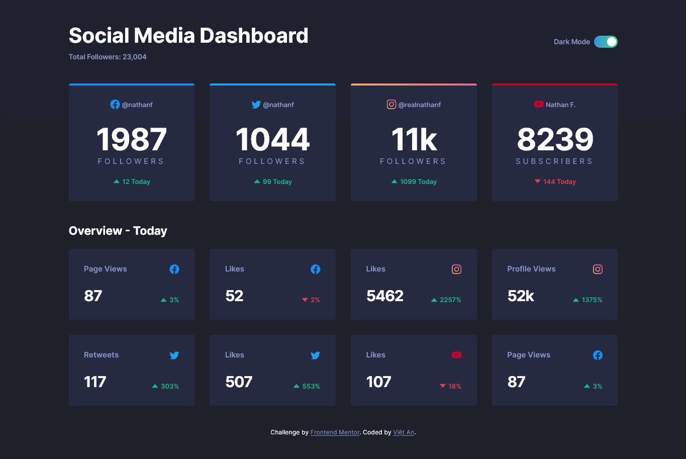

# Frontend Mentor - Social media dashboard with theme switcher solution

This is a solution to the [Social media dashboard with theme switcher challenge on Frontend Mentor](https://www.frontendmentor.io/challenges/social-media-dashboard-with-theme-switcher-6oY8ozp_H). Frontend Mentor challenges help you improve your coding skills by building realistic projects.

TIL about [shields.io](https://shields.io/)


## Table of contents

- [Overview](#overview)
  - [The challenge](#the-challenge)
  - [Screenshot](#screenshot)
  - [Links](#links)
- [My process](#my-process)
  - [Built with](#built-with)
  - [What I learned](#what-i-learned)
  - [Continued development](#continued-development)
- [Author](#author)

## Overview

### The challenge

Users should be able to:

- View the optimal layout for the site depending on their device's screen size
- See hover states for all interactive elements on the page
- Toggle color theme to their preference

### Screenshot



### Links

- [Solution Page on Frontend Mentor](https://www.frontendmentor.io/solutions/social-media-dashboard-with-theme-switcher-using-sass-css-variables-a95s14FsI8)
- [Live Website](https://fm-social-dashboard-theme-vietan0.netlify.app/)

## My process

### Built with

- [React](https://reactjs.org/)
- [Sass](https://sass-lang.com/documentation/)
- [normalize.css](https://necolas.github.io/normalize.css/) for defining a baseline (lacking, tbh, don't even have `box-sizing: border-box`)
- Semantic HTML5 markup
- CSS custom properties
- Flexbox
- CSS Grid

### What I learned

- Start using ESLint (and Airbnb Style Guide)
- Start looking up GitHub issues when encountering problems
- Start using `propTypes`
- How to approach building a theme using **both** Sass `$variables` and CSS `--variables` ([from article](https://dev.to/zetareticoli/dark-mode-with-sass-and-css-variables-4f9b))
- Organize (modularize) Sass files for cleaner code
- Few `ESLint` problems I ran into:
  - `react/no-unknown-property` false positive `checked`: [GitHub Issue](https://github.com/jsx-eslint/eslint-plugin-react/issues/3383)
  - Airbnb's `label-has-associated-control` rule: [GitHub Issue](https://github.com/airbnb/javascript/issues/1885)
- Create a helpful outline:

```scss
// @include wherever you want
@mixin debug() {
  outline: 3px solid hotpink;
  > * {
    outline: 1px dashed hotpink;
  }
}
```

- `isolation`, `z-index` and Stacking Context

```scss
// make a pseudo-element stay behind ONLY its siblings
div {
  position: relative;
  isolation: isolate;

  &::before {
    position: absolute;
    z-index: -1;
  }
}
```

- Meet "parent" selector `:has()`:

```scss
label[for='switch']:has(#switch:checked) {
  background: red;
}
```

- Make text color gradient

```scss
// make text color gradient
p {
  color: transparent;
  background-clip: text; // key
  background: linear-gradient(red, blue);
}
```

- Detect system's theme using JS ([StackOverflow](https://stackoverflow.com/a/57795495/17673377)):

```jsx
const [darkMode, setDarkMode] = useState(false);
useEffect(() => {
  // sync system's theme with React state when page first loads
  if (window.matchMedia && window.matchMedia('(prefers-color-scheme: dark)').matches) {
    setDarkMode(true);
  }
}, []);
```

### Continued development

- Be more like a librarian
- Look into styled-components
- Nest less when using Sass
- Learn writing git messages?

## Author

-   Frontend Mentor - [@vietan0](https://www.frontendmentor.io/profile/vietan0)
-   Linkedin - [@vietan](https://www.linkedin.com/in/vietan/)
